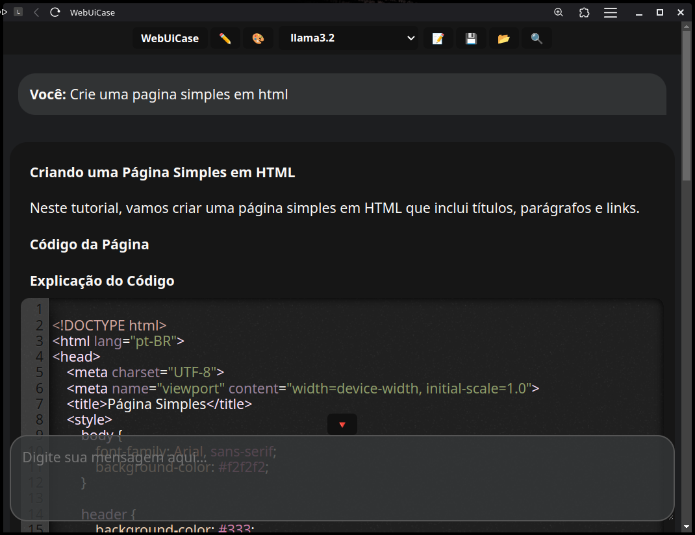

# WebUiCase - Interface Web para Ollama Caseiro

**WebUiCase** é uma interface web leve e personalizável para interagir com modelos de linguagem locais via Ollama. Desenvolvida em HTML, CSS e JavaScript, sem frameworks, com opções de servidores simples em Bash e Python, esta aplicação permite aos usuários enviar prompts, visualizar respostas em tempo real, gerenciar conversas, criar especialistas e muito mais, tudo em uma interface amigável e estilizada. Totalmente privativo, não salva as conversas por padrão, funciona completamente offline e permite salvar conversas localmente no navegador, garantindo que seus dados permaneçam no seu dispositivo.

  
*(PrintScreen atual do WebUiCase)*

## Sumário
- [Funcionalidades](#funcionalidades)
- [Pré-requisitos](#pré-requisitos)
- [Instalação](#instalação)
- [Uso](#uso)
- [Dicas e Macetes](#dicas-e-macetes)
- [Estrutura do Projeto](#estrutura-do-projeto)
- [Contribuição](#contribuição)
- [Licença](#licença)

---

## Funcionalidades

O WebUiCase oferece uma ampla gama de recursos para interação com modelos de IA locais via Ollama:

### 1. **Interação com Modelos Ollama**
- Envie prompts diretamente para o Ollama através de uma textarea fixa na parte inferior da tela.
- Receba respostas em tempo real com suporte a streaming.
- Suporte a múltiplos modelos listados automaticamente via API do Ollama.

### 2. **Histórico de Conversas**
- Armazene e recupere localmente o histórico de mensagens para manter o contexto.
- Navegue pelo histórico de prompts com as setas `↑` e `↓` como no terminal.

### 3. **Formatação de Respostas**
- Suporte a Markdown para respostas da IA (negrito, itálico, cabeçalhos, links, imagens, etc.) usando o **marked.js** *(por enquanto, estamos criando uma solução mais adequada)*.
- Blocos de código destacados com **CodeMirror**, com suporte dinâmico a linguagens como Python, JavaScript, HTML, CSS, Bash e mais.

### 4. **Personalização**
- **Temas**: Alterne entre dezenas de temas do CodeMirror com o botão 🎨.
- **Especialistas**: Crie perfis de especialistas com prompts personalizados salvos no `localStorage` do navegador.
- **Conversas Salvas**: Salve e carregue conversas nomeadas para reutilização (incopleto).

### 5. **Ferramentas de Edição e Busca**
- Busca de texto em tempo real com destaque de ocorrências e navegação cíclica (🔍).
- Restauração automática de seleção de texto após renderização Markdown.
- Rolagem automática opcional com botão de retorno ao final (🔻).

### 6. **Interface Intuitiva**
- Menu fixo com botões, nova conversa, salvar conversa, temas, modelos e gerenciamento de especialistas/conversas.
- Tooltips interativos ao passar o mouse sobre botões (atributo `legenda`).
- Design responsivo com suporte a dispositivos móveis.

---

## Pré-requisitos

- **Ollama**: Instale o Ollama e tenha modelos locais disponíveis (requisito: `llama3.2`). Veja [ollama.com](https://ollama.com) para instruções.
- **Servidor Web**: Use os scripts fornecidos (WebUiCase.sh ou WebUiCase.py) para rodar localmente.
- **Navegador**: Um navegador moderno (Chrome, Firefox, Brave, etc.).
- **Dependências para Bash**:
  - `ncat` (parte do pacote `nmap`): `sudo apt install nmap` (Linux) ou equivalente.
  - Opcional: `brave-browser` para abrir automaticamente. Necessário mudar o id do app dentro do script
- **Dependências para Python**: Apenas o Python 3.x padrão (sem bibliotecas externas).

---

## Instalação

1. **Clone o Repositório**
   ```bash
   git clone https://github.com/seu-usuario/WebUiCase.git
   cd WebUiCase
   ```

2. **Escolha o Servidor**
   - **Opção 1: Bash**
     - Dê permissão ao script:
       ```bash
       chmod +x WebUiCase.sh
       ```
     - Execute:
       ```bash
       ./WebUiCase.sh
       ```
   - **Opção 2: Python**
     - Dê permissão ao script (opcional):
       ```bash
       chmod +x WebUiCase.py
       ```
     - Execute:
       ```bash
       python3 WebUiCase.py
       ```

4. **Acesse**
   - Abra `http://localhost:3000` no navegador. O servidor abrirá automaticamente o arquivo `WebUiCase.html`. Crie um WebApp pelo navegador (configurações > Salvar e compartilhar > Instalar pagina como app...) pegue o id e coloque no script bash. (para virar um app web)

---

## Uso

### Início Rápido
1. Execute o servidor (Bash ou Python).
2. O navegador abrirá automaticamente em `http://localhost:3000`.
3. Digite um prompt na textarea inferior e pressione `Enter` para enviar.
4. Veja a resposta da IA aparecer em tempo real na área de resposta.

### Comandos do Teclado
- `Enter`: Envia o prompt.
- `Shift + Enter`: Adiciona uma nova linha no prompt.
- `↑` (Seta para cima): Recupera o prompt anterior.
- `↓` (Seta para baixo): Avança no histórico ou limpa o campo.

### Menu Superior
- **WebUiCase**: Inicia uma nova conversa (limpa o histórico).
- **✏️**: Renomeia a conversa atual (não implementado no Bash/Python, apenas frontend).
- **🎨**: Alterna entre temas do CodeMirror.
- **Modelos**: Seleciona o modelo Ollama a ser usado (llama3.2 por padrão).
- **📝**: Cria ou gerencia especialistas (prompts personalizados).
- **💾**: Salva a conversa atual no navegador usado.
- **📂**: Abre conversas salvas.
- **🔍**: Ativa a busca de texto na página.

---

## Dicas e Macetes

### 1. **Personalize Especialistas**
- Digite um prompt na textarea correspondente ao especialista e Clique em 📝, e forneça um nome para salvá-lo.
- Use especialistas para criar \"personas\" de IA (ex.: \"Especialista em Python\", \"Tutor de Matemática\", "diretor de videos e roteiros").
- Edite ou exclua especialistas com os botões ✏️ e 🗑️.

### 2. **Gerencie Conversas**
- Salve conversas importantes com 💾 e carregue-as com 📂.
- Use nomes descritivos para facilitar a recuperação.
- considere isso aliado com um especialista um checkpoint extraordinário!

### 3. **Aprimore a Busca**
- Ative a busca (🔍), digite um termo e pressione o botão ou use `Enter` para navegar pelas ocorrências.
- Feche a busca com ❌ para limpar os destaques.

### 4. **Rolagem Automática**
- A rolagem automática é ativada por padrão. Role para cima para desativá-la e use 🔻 para voltar ao final.

---

## Estrutura do Projeto

```
WebUiCase/
├── WebUiCase.html  # Interface principal
├── WebUiCase.sh       # Minimal server Bash para servidor
├── WebUiCase.py       # Minimal server Python para servidor
└── README.md       # Este arquivo
```

- **WebUiCase.html**: Contém toda a interface em HTML, CSS e JavaScript.
- **WebUiCase.sh**: Usa `ncat` para servir o HTML na porta 3000 e abrir o Brave Browser.
- **WebUiCase.py**: Usa `http.server` do Python para um servidor na porta 3000.

---

## Contribuição

1. Faça um fork do repositório.
2. Crie uma branch para sua feature:
   ```bash
   git checkout -b minha-feature
   ```
3. Commit suas mudanças:
   ```bash
   git commit -m \"Adiciona minha feature\"
   ```
4. Envie para o repositório remoto:
   ```bash
   git push origin minha-feature
   ```
5. Abra um Pull Request.

Sugestões de melhorias:
- Implementar um frontend para salvar conversas e configurações.
- Criação propria de Markdown e estilização de codigo
- implementar outras apis privadas (ChatGPT, Grok, DeepSeek, Minstral etc..)

---

## Licença

Este projeto está sob a licença MIT. Veja o arquivo [LICENSE](LICENSE) para detalhes.

---

Feito com ❤️ por diversalizando  | [GitHub](https://www.youtube.com/@DIVERSALIZANDO)  
Dúvidas? Abra uma issue ou entre em contato!